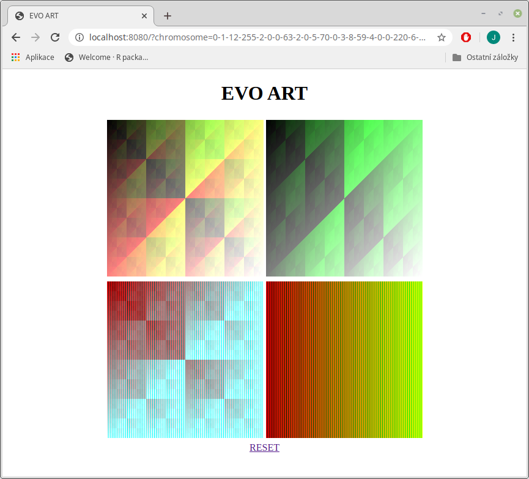

# Evo Art

Evo art is a simple experimental web application
which uses Cartesian Genetic Programming (CGP)
to evolve aesthetically interesting images.
This application is inspired by
[Evolutionary Art with Cartesian Genetic Programming](https://www.researchgate.net/profile/Julian_Miller/publication/230855629_Evolutionary_Art_with_Cartesian_Genetic_Programming/links/0046352c2d562bba54000000.pdf)
paper.



## Run using published binaries

Download the binary file for your computer architecture and operating system from
the latest [release page](https://github.com/jiripetrlik/evo-art/releases).
Run the downloaded file. Open the application using a web browser on [http://localhost:8080].

## Build and run the application

Evo Art is written in Go language.
Use `go build` command to compile the application.
It will create `evo-art` binary file. To run the
application simply run `./evo-art` binary. It
will expose web interface on `http://localhost:8080`.

## Run using Docker

Evo Art is also available as a Docker image in the
[Docker Hub repository](https://hub.docker.com/r/jiripetrlik/evo-art).
Use following command to run Evo Art using Docker:
```
docker run -d --name evo-art -p 8080:8080 jiripetrlik/evo-art
```

To build Docker image yourself type this command in the
project directory:

```
docker build . -t evo-art
```
